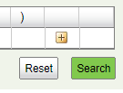
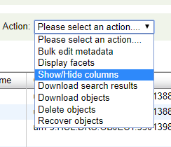
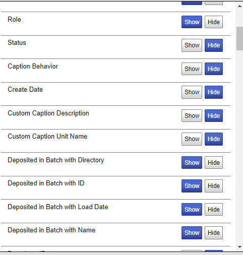

# drs-deposit
Harvard DRS Deposit base
# Daily Workflow
Note this is a high level summary, at the checklist level. It does not describe details of installation and operations.
## Dramatis Personae

+ Druk: The BatchBuilding platform. Platform requires:
	- Python 3.6 in a virtual environment
	- Bash v3
	- drs-deposit github - only needs DRS-BATCH-PROCESSING folder, not complete repository
	- drs-deposit/DBApps installed (see DBApps/setup.py)
	- drs-deposit/DRS-BATCH-PROCESING and drs-deposit/DRS-BATCH-PROCESSING/parallelBatch in your path.[^4487da72]
+ Khyung: Uploading platform. Requires:
	- Python 3.6 (recomended in a virtual environment)
	- Cisco VirtualConnect software (from Harvard)
+ Optional: another machine with Cisco AnyConnect software

[^4487da72]: I link the files I need into `~/bin`.

Except for downloading the CSVs, and the step of collecting the error results, all these steps are command line, so you can run them through `ssh`. I advise you run them under `tmux`, so that long running commands don't pin down your machine.

## Steps
Host  | Action  |Comments
--|---|--
Any PC|Get Deposit Updates   |Log on to the Harvard VPN. Point a browser to [WebAdminSearch][68fcc779]  
  |Get all deposits to date|  
  |   |Search for Objects. In the URL, if you don't see the + button () Click the 'Reset' button     
  |   | Search for objects with this billing code 
  |   |Select  Action 'show/hide columns'    
  |   |Add 'Insertion Date' 'Deposited in Batch With {Directory, ID, LoadDate, Name}'   
  |   |Select Action 'download search results.'  
  |   |Save to your drs-deposit working directory output/BDRCCumulativeProdDeposits.csv  
  |Get last period's deposits | Run another search, looking for only the incremental change. See `~/drs-deposit/output/DepositUpdates` and figure out the latest deposit date You will have to look in the newest file to look at the latest Insertion date(not _createDate_). The date picker's basis starts at midnight, so if you pick 28 June in the calendar, you are getting everything newer than 28 June 00:00:00 Zulu|
  |   |**If you are doing this in the same browser session, you will get the same columns you did before. If you have left the WebAdminSearch site, and returned, select Hide/Show columns as above.**  
  |   |Don't worry if your incremental files contain overlapping dates: the DRS database can cope. Better than missing dates.
   |Commit and Push | Make these changes available to other machines.  
Druk |Update the DRS database | Any PC with the Python library installed, and the DRS Db dbConfig files, could do this, but because of the DRS database restrictions on remote access, this is best done on a machine in the BDRC network.  
  |Create a work area [^b4db8524]  | I use `Druk:~jimk/runs/prod/yyyy/mm/dd`  The process is location independent, but must have access to the `Khyung:DRS_Staging` share, and must declare an environment variable `$PR=/Volumes/DRS_Staging/DRS/prod`
  | Get the next ready works  | Run the command `DRSUpdate -d prod:~/.drsBatch.dbConfig <location you saved the incremental file ...drs-deposit/output/DailyUpdates/whatveverfile`. This updates the database with the latest builds, so that getting the next tranche of files to build can proceed.
  |Make sure the last batch building run completed.   | Don't worry about failures. There's a separate workflow coming for batchBuild failures
  |Get the next round of ready files | Run the python script `getReadies -d prod:~/.drsBatch.dbConfig -n <someNumber> <someFilePath>`  It turns out we can build about 500 batches in a day, using three streams, so `-n 500` is reasonable. **Warning: this process is slow, and is a memory pig.** You can do this serially to `-n 100 someFilePath[1...n]` and then cat `someFilePath[1..n]` together.
  | Prepare to run  | Figure out how many parallel executions you want to run. 4 is a useful upper limit (we've seen that, after 3 parallels, the 4th, 5th, and later streams get starved for CPU)
  |   |Split the readylist into the number of streams  `splitWorks -n 3`**This is not** `splitWorks.sh`  
  | Off with his head! | Start a tmux session. This runs for a long time, and you dont want to depend on your console access.
  |And go | Launch `runMultiple.sh filespecOfYourSlitWorks output'` for example: `runMultiple.sh myBuildCandidates[1-3].txt` `runMultiple.sh` spawns many background processes (one per file in its arguments list), and then exits. No advantage to running it in the background.
  | Checking status  | In the same working directory, examine the `timin/underway` and `timing/finishedRuns` directory.

  [68fcc779]: http://nrs.harvard.edu/urn-3:hul:drs2-admin "Harvard Web Admin Search"
[^b4db8524]: Details of the following section are in: [Building Batches][65e185e8] 

  [65e185e8]: ./BatchBuilding.md "Building Batches"
